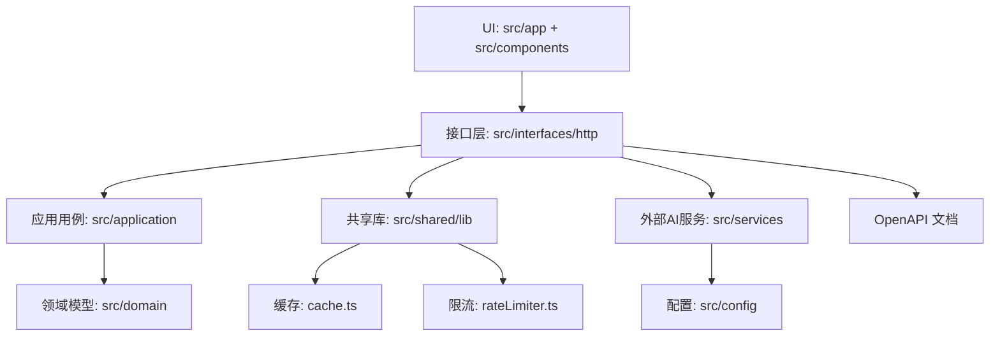

# 架构与数据流

```mermaid
flowchart TD
    UI[UI: src/app + src/components] --> IF[接口层: src/interfaces/http]
    IF --> UC[应用用例: src/application]
    UC --> DM[领域模型: src/domain]
    IF --> SL[共享库: src/shared/lib]
    SL --> Cache[缓存: cache.ts]
    SL --> RL[限流: rateLimiter.ts]
    IF --> API[外部AI服务: src/services]
    API --> Conf[配置: src/config]
    IF --> Docs[OpenAPI 文档]
```

## 关键原则
- 分层清晰：UI→接口→用例→领域→共享
- 可观测：logger、metrics、traceId 贯穿关键路径
- 稳态保障：限流、并发栅栏、幂等与缓存

## 缓存策略
- 端到端 ETag/If-None-Match
- LRU 内存缓存 + TTL 配置化
- 前缀失效辅助方法
