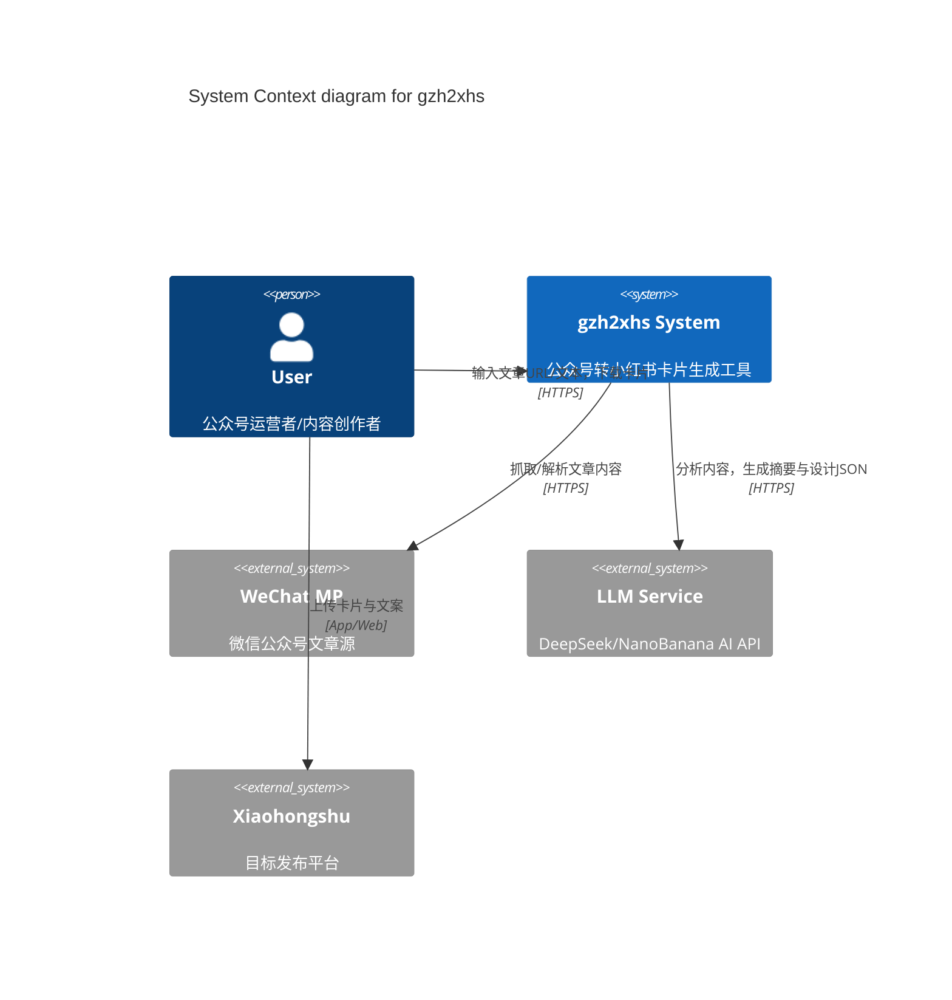
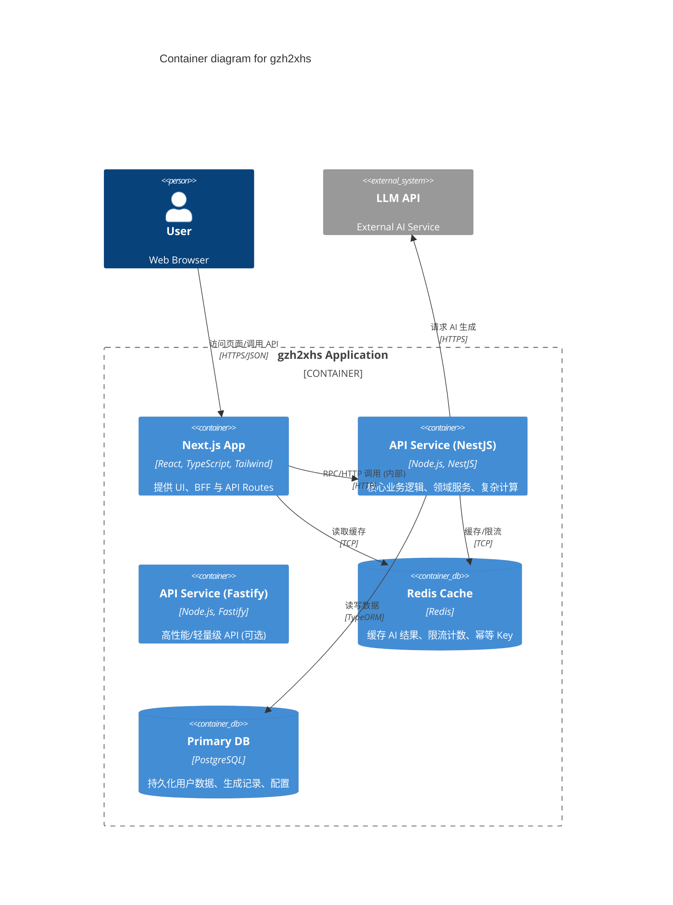

# 架构设计文档 (C4 Model)

本文档采用 C4 模型描述 gzh2xhs 系统的软件架构。

## 1. Context View (系统上下文)



## 2. Container View (容器视图)



## 3. Component View (组件视图 - API Service)

```mermaid
C4Component
    title Component diagram for API Service (NestJS)

    Container(api, "API Service", "NestJS") {
        Component(controller, "GenerateController", "Controller", "接收生成请求，参数校验")
        Component(usecase, "GenerateCardUseCase", "UseCase", "编排生成流程：内容获取->AI分析->绘图")
        Component(domain_service, "AIService", "Domain Service", "封装 LLM 调用逻辑与 Prompt")
        Component(infra_img, "ImageConverter", "Infrastructure", "Playwright/Sharp 渲染 SVG 为 PNG")
        Component(repo, "RecordRepository", "Repository", "生成记录持久化")
    }

    Rel(controller, usecase, "Execute")
    Rel(usecase, domain_service, "Analyze Text")
    Rel(usecase, infra_img, "Render Image")
    Rel(usecase, repo, "Save Record")
```

## 4. 关键交互流程

### 卡片生成流程

1. **User** 提交文本/URL。
2. **Web App** 检查 Redis 缓存 (Cache-Aside)。
3. 若未命中，调用 **API Service**。
4. **GenerateUseCase** 并行执行：
   - 调用 **AIService** 获取摘要与设计 JSON。
   - 调用 **WeChatService** (若是URL) 解析正文。
5. **GenerateUseCase** 组合数据，调用 **ImageConverter** 生成图片。
6. 结果存入 **Redis** 并返回。
